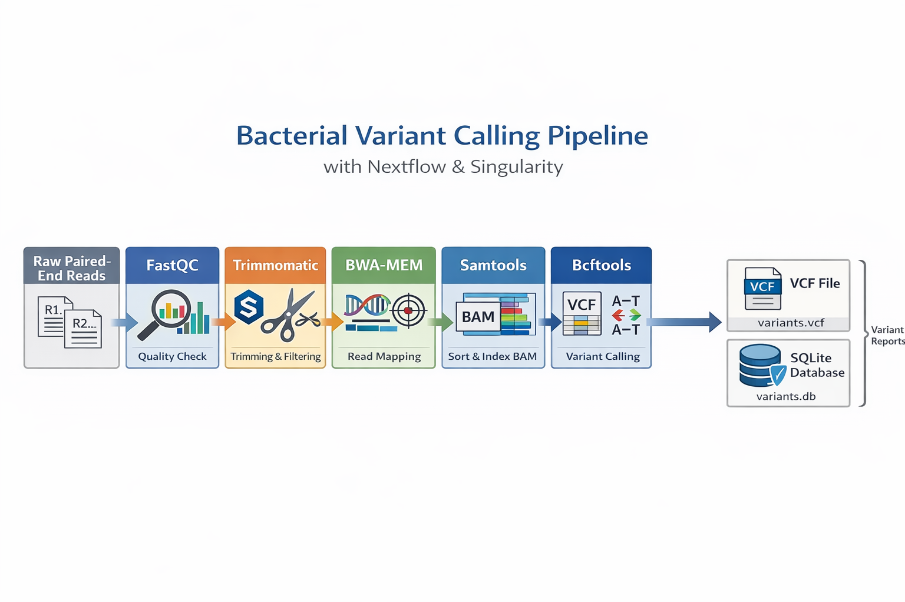

# Variant calling workflow (Nextflow DSL2 + Singularity)

<p align="center">
  
</p>

<p align="center">
  
  
  
  
</p>

Minimal, **assignment-focused** pipeline: raw reads ➜ QC ➜ trimming (in Singularity) ➜ alignment ➜ BAM ➜ variant calling ➜ **SQLite DB**.

---

## Repository

```
Final_Assignment/
├── data/
│   ├── mutant_R1.fastq
│   ├── mutant_R2.fastq
│   └── wildtype.fna
├── main.nf
├── nextflow.config
├── trimmomatic.def
├── trimmomatic_user.sif      
└── results/ (created at runtime)
    ├── fastqc/
    ├── trimmomatic/
    ├── bwa/
    ├── bam/
    ├── vcf/variants.vcf
    └── db/
        ├── variants.db
        ├── variant_summary.csv
        ├── snv_indel_counts.csv
        ├── substitution_spectrum.csv
        └── top_quality_variants.csv
```

**Inputs used in this assignment**
- Paired reads: `data/mutant_R1.fastq`, `data/mutant_R2.fastq`
- Reference: `data/wildtype.fna`

---

## Build the Trimmomatic image (Singularity)

Definition: `trimmomatic.def` (Ubuntu 22.04 + Java + Trimmomatic 0.39)

```bash
singularity build --fakeroot trimmomatic_user.sif trimmomatic.def
```

---

## Run the pipeline

Requirements on HPC:
- `module load nextflow`
- `module load fastqc bwa samtools bcftools`
- Python 3 (for SQLite step)

Run from the project root:
```bash
module load nextflow
nextflow clean -f
rm -rf .work results
mkdir -p results
nextflow run main.nf -profile local -w ./.work
```

At completion:
```
Final VCF: results/vcf/variants.vcf
SQLite DB: results/db/variants.db
Summary CSV files:
  - results/db/variant_summary.csv
  - results/db/snv_indel_counts.csv
  - results/db/substitution_spectrum.csv
  - results/db/top_quality_variants.csv
```

---

## Processes
1. **FASTQC** – QC on `mutant_R1/2.fastq`
2. **TRIMMOMATIC** *(Singularity)* – trim adapters/low‑quality reads
3. **BWA‑MEM** – align to `wildtype.fna`
4. **SAMTOOLS sort** – produce `sorted.bam`
5. **BCFTOOLS call** – produce `variants.vcf`
6. **VCF ➜ SQLite** – build `variants.db` with one table:

```sql
CREATE TABLE variants (
  chromosome  TEXT,
  position    INTEGER,
  reference   TEXT,
  alternative TEXT,
  quality     REAL
);
```

**Additional Results :** CSV summaries for SNV/INDEL counts, substitution spectrum, and top‑QUAL variants under `results/db/`.

---

## Quick checks

```bash
python3 - <<'PY'
import sqlite3
con = sqlite3.connect('results/db/variants.db'); cur = con.cursor()
print('Total variants:', cur.execute('SELECT COUNT(*) FROM variants').fetchone()[0])
print('Top 5 by QUAL:')
for r in cur.execute('SELECT * FROM variants ORDER BY quality DESC LIMIT 5'):
    print(r)
con.close()
PY
```

---

## Troubleshooting
- `nextflow: command not found` → `module load nextflow`
- `Cannot create work-dir` → run from repo root; use `-w ./.work`; ensure `.work/` exists
- CPU/mem errors → reduce `cpus` in `nextflow.config` or request resources via SLURM

---

**Author:** Azwinndini Simon Mufara  •  **License:** MIT
